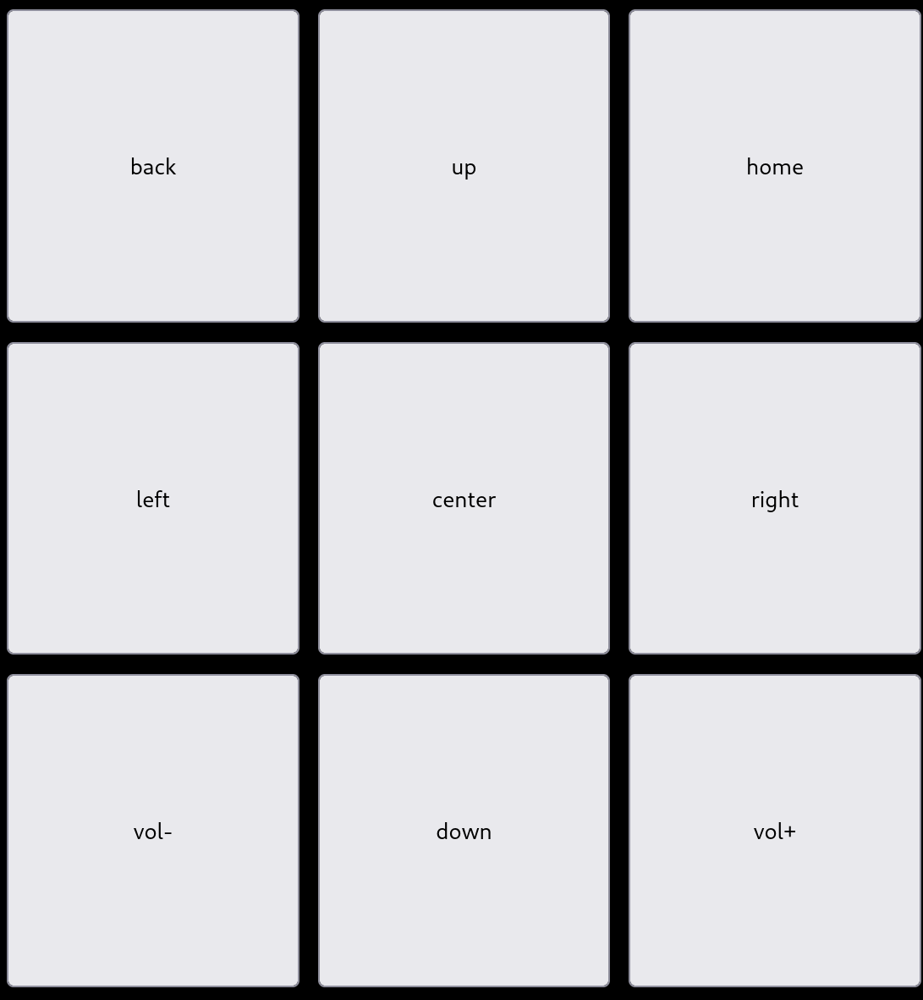

Piece parts of a system for remotely controlling an android TV from a webpage.

Example setup:

- android TV box, such as the Nvidia Shield TV.  It is controlled via ADB.
- Linux server that:
  - runs nginx to serve the included `index.html` and `style.css`
  - runs an mqtt-broker
  - has mosquitto-mqtt, adb, and guile scheme installed
  - uses the `shield-buttons-mqtt.service` to run the guile `shield-buttons-mqtt.scm` service
  - runs an openhab2 instance that maps the mqtt topics to openhab2 items so that posts from the `index.html` are handed off to the `shield-buttons-mqtt.scm`.

Example webpage use:

